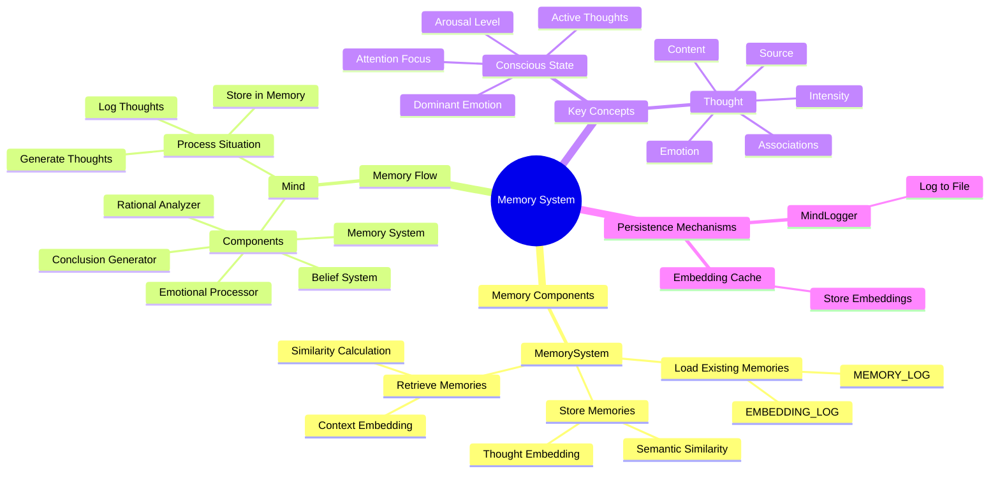
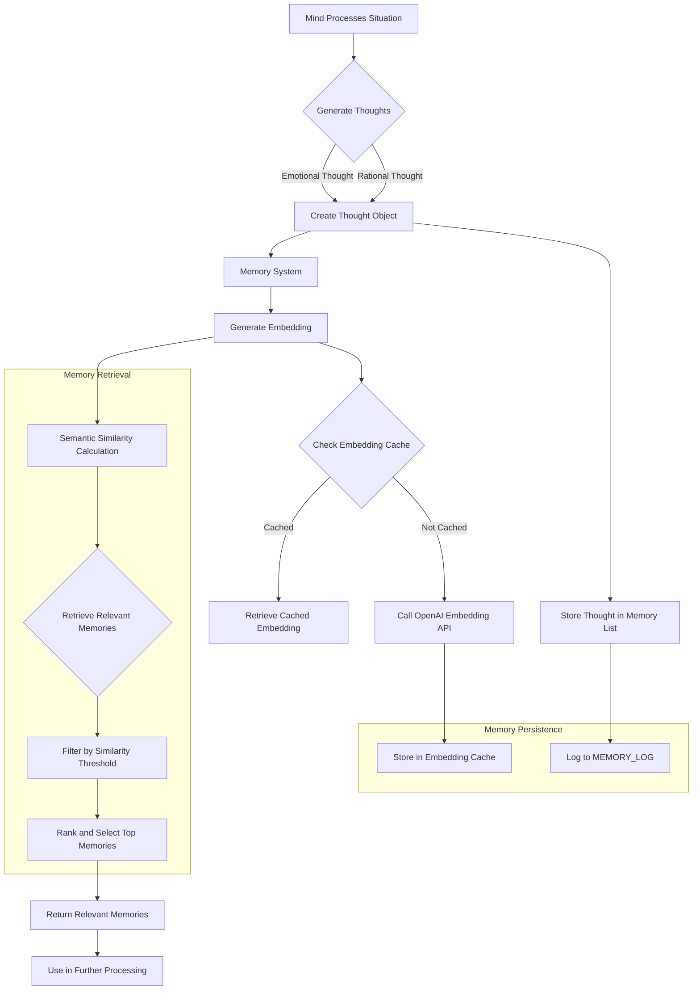
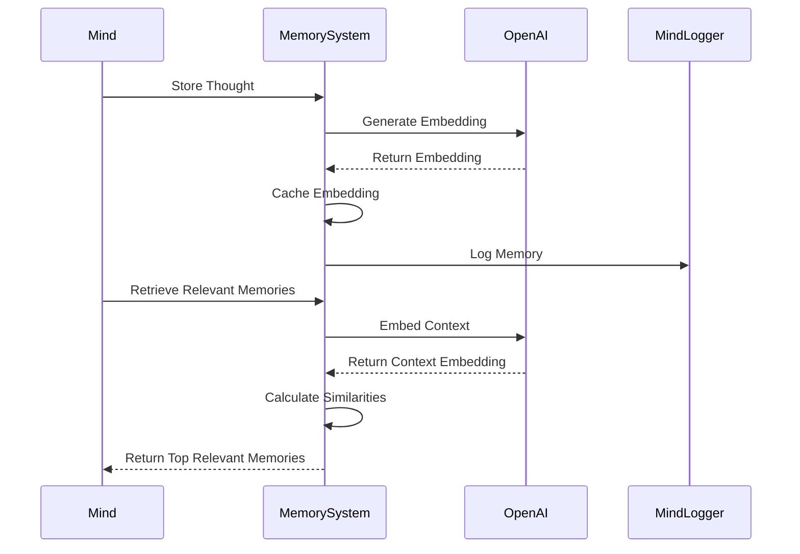

## Memory System Workflow

## Memory Interaction Sequence

### Key Workflow Explanations

1. **Thought Generation**: 
   - Mind generates emotional and rational thoughts
   - Each thought is converted to a Thought object

2. **Embedding Process**:
   - Generate embeddings using OpenAI's API
   - Cache embeddings for performance
   - Store in MEMORY_LOG

3. **Memory Retrieval**:
   - Embed current context
   - Calculate semantic similarity
   - Filter and rank memories
   - Return most relevant memories

4. **Persistence Mechanisms**:
   - Log thoughts to MEMORY_LOG
   - Cache embeddings in memory
   - Support for loading existing memories on startup
